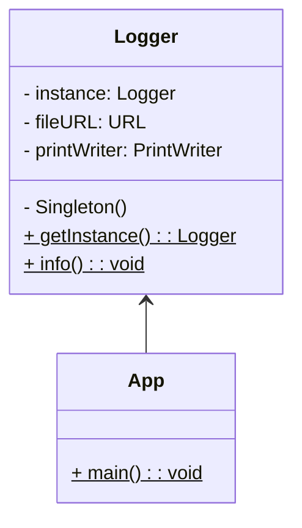

```mermaid
classDiagram
    class Logger {
        - instance: Logger
        - fileURL: URL
        - printWriter: PrintWriter
        - Singleton()
        + getInstance()$: Logger
        + info()$: void
    }
    class App {
        + main()$: void
    }
    Logger<--App
```